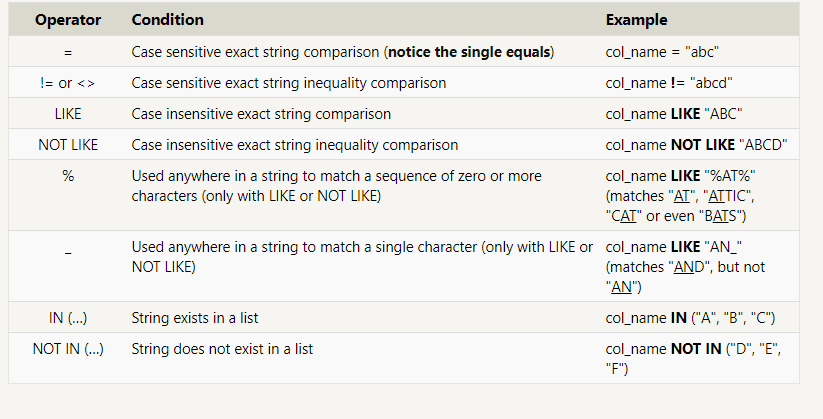

#  SQL
its a *Structured Query Language* designed to allow both technical and non-technical users query, manipulate, and transform data from a relational database.

All of this websites and mobile applications support SQL language standard:
1. SQLite
2. MySQL
3. Postgres
4. Oracle
5. Microsoft SQL Server.
And many other of this websities.

To retrieve data from the database we need select statment it will refered to the query which declares :
- Data type 
- data loaction

SELECT FROM mytable; This query, in particular, is really useful because it's a simple way to inspect a table by dumping all the data at once.

SELECT title FROM movies;
SELECT director FROM movies;
SELECT title, director FROM movies;
SELECT title, year FROM movies;

complex clauses can be constructed by joining numerous logical keywords like:
- AND
- OR

When writing WHERE clauses with columns containing text data, SQL supports operators to do:
1. case-insensitive string comparison.
2. wildcard pattern matching.

directors of movies (alphabetically)
SELECT DISTINCT director FROM movies ORDER BY director ASC;

last four movies released (ordered from most recent to least)
SELECT title, year FROM movies ORDER BY year DESC LIMIT 4;

List the first five Pixar movies sorted alphabetically
SELECT title FROM movies ORDER BY title ASC LIMIT 5;

List the next five Pixar movies sorted alphabetically
SELECT title FROM movies ORDER BY title ASC LIMIT 5 OFFSET 5;