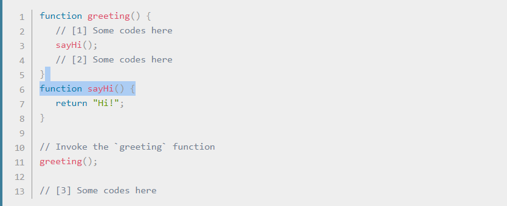

# The Call Stack and Debugging

## call stack 
its mechanism for an interpreter to keep track of its place in a script that calls multiple functions

1. When a script calls a function, the interpreter adds it to the call stack and then starts carrying out the function.
2. Any functions that are called by that function are added to the call stack further up, and run where their calls are reached.
3. When the current function is finished, the interpreter takes it off the stack and resumes execution where it left off in the last code listing.
4. If the stack takes up more space than it had assigned to it, it results in a "stack overflow" error.

Example :

## Understanding the JavaScript call stack 
The call stack is primarily used for function invocation (call). Since the call stack is single, function(s) execution, is done, one at a time, from top to bottom. It means the call stack is synchronous.
In Asynchronous JavaScript, we have a callback function, an event loop, and a task queue. The callback function is acted upon by the call stack during execution after the call back function has been pushed to the stack by the event loop.

The key takeaways from the call stack are:
1. It is single-threaded. Meaning it can only do one thing at a time.
2. Code execution is synchronous.
3. A function invocation creates a stack frame that occupies a temporary memory.
4. It works as a LIFO — Last In, First Out data structure.

## JavaScript error messages

Types of error messages

1. Reference errors
2. Syntax errors
3. Range errors
4. Type errors