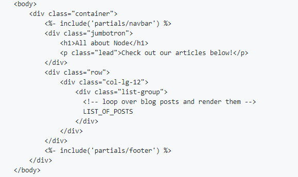

#  Components

Partials come in handy, to reuse the same HTML across multiple views. you define that reusable bundle of code in a file andinclude it wherever you need it

partials  we can use them in our home.ejs and post.ejs templates! In EJS, any JavaScript or non-HTML syntax you include in your templates is always surrounded by <% %> delimiters

Intro to EJS - Partials

partials unlike layout are native to ejs
navbar footer (static)
on server.js (check that everything is ok)
on the views folder create partials folder and inside it onepartial.ejs file
on layout.ejs file :
<%- body %>
<%- include('partials/onepartial') %>