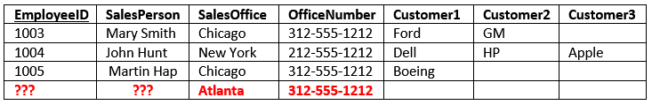
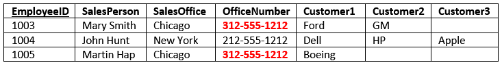

# Database Normalization 

## Introduction to Database Normalization

1. Process used to organize a database into tables and columns.
2. Table should be about a specific topic and only supporting topics included.
3. By limiting a table to one purpose

By limiting a table to one purpose you reduce the number of duplicate data contained within your database. This eliminates some issues stemming from database modifications.

Reasons for Database Normalization there are three main reasons :

1. minimize duplicate data 
2. minimize or avoid data modification issues 
3. simplify queries

## Data Duplication and Modification Anomalies

There are three modification anomalies that can occur:
1. Insert Anomaly

2. Update Anomaly

3. Deletion Anomaly

## Definition of Database Normalization

There are three common forms of database normalization:

1. 1st 1NF normal form: The information is stored in a relational table with each column containing atomic values. There are no repeating groups of columns.
2. 2nd 2NF normal form: The table is in first normal form and all the columns depend on the table’s primary key.
3. 3rd 3NF normal form: the table is in second normal form and all of its columns are not transitively dependent on the primary key.

